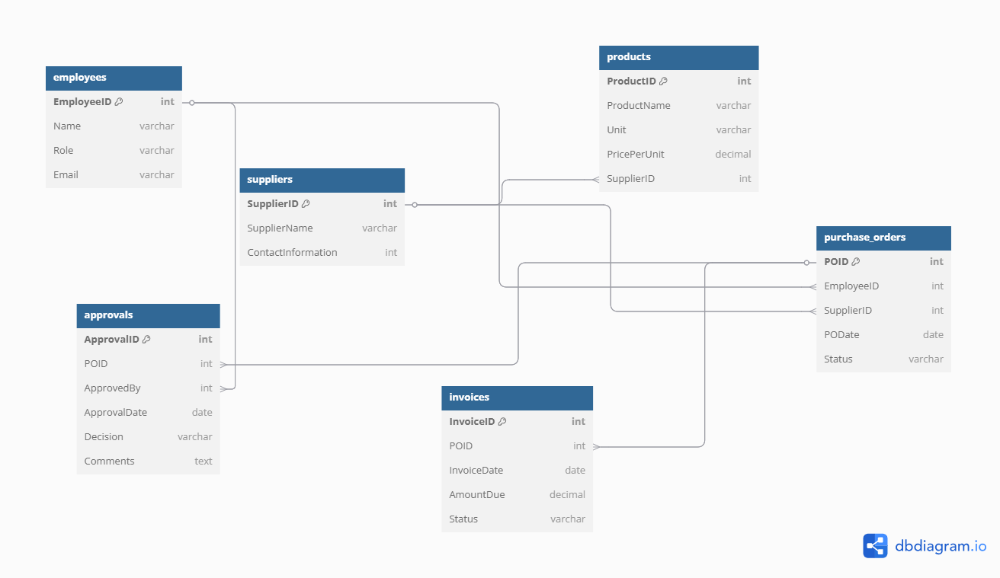

# Database Project

This project provides a comprehensive database solution for managing procurement and judicial processes. It includes Entity-Relationship Diagrams (ERDs), SQL scripts for database creation and population, and a Node.js API for interacting with the judicial database.

---

## Procurement ERD



The Procurement ERD illustrates the database structure for managing procurement processes, including entities such as employees, suppliers, products, purchase orders, approvals, and invoices.

---

## Judicial ERD


The Judicial ERD represents the database structure for judicial processes, including entities such as judges, cases, and hearings.

---

## Project Overview

This project is designed to manage and visualize procurement and judicial processes. It includes:

- **Entity-Relationship Diagrams (ERDs)** for both procurement and judicial domains.
- **SQL scripts** to create and populate the databases.
- **A Node.js API** for CRUD operations on the judicial database.

---

## Folder Structure

The project is organized as follows:

- **`/procurement.png`**: Contains the Procurement ERD diagram.
- **`/procurement.sql`**: SQL script for creating and populating the procurement database.
- **`/judicial database/`**: A folder dedicated to the judicial database, containing:
  - **`judical.png`**: The Judicial ERD diagram.
  - **`judicial.sql`**: SQL script for creating and populating the judicial database.
  - **`index.js`**: A Node.js API for interacting with the judicial database.
  - **`package.json`**: Node.js project configuration file with dependencies.
  - **`package-lock.json`** : Node.js -Locks Dependencies to Exact Versions
- **`/README.md`**: The main documentation file for the project.

---

## Features

### Procurement Database
- **Entities**: Employees, Suppliers, Products, Purchase Orders, Approvals, and Invoices.
- **Relationships**: Includes foreign key constraints to enforce data integrity.
- **Pre-populated Data**: Sample data for testing and demonstration purposes.

### Judicial Database
- **Entities**: Judges, Cases, and Hearings.
- **Relationships**: Includes foreign key constraints to link cases to judges and hearings to cases.
- **Pre-populated Data**: Sample data for testing and demonstration purposes.
- **Node.js API**: Provides endpoints for CRUD operations on the judicial database.

---

## Node.js API for Judicial Database

The API is built using Express and MySQL2. It provides the following endpoints:

### Judges
- **POST** `/judges`: Add a new judge.
- **GET** `/judges`: Retrieve all judges.
- **PUT** `/judges/:id`: Update a judge's details.
- **DELETE** `/judges/:id`: Delete a judge.

### Cases
- **POST** `/cases`: Add a new case.
- **GET** `/cases`: Retrieve all cases.
- **PUT** `/cases/:id`: Update a case's details.
- **DELETE** `/cases/:id`: Delete a case.

### Hearings
- **POST** `/hearings`: Add a new hearing.
- **GET** `/hearings`: Retrieve all hearings.
- **PUT** `/hearings/:id`: Update a hearing's details.
- **DELETE** `/hearings/:id`: Delete a hearing.

---

## Getting Started

### Setting Up the Databases
1. Open the SQL scripts (`procurement.sql` and `judicial.sql`) in your preferred SQL client.
2. Execute the scripts to create and populate the databases.

### Running the Node.js API
1. Navigate to the `judicial database` folder.
2. Install dependencies:
   ```bash
   npm install
   ```
3. Start the server:
   ```bash
   npm start
   ```
4. The API will be available at `http://localhost:3000`.

### Testing the API
You can test the API endpoints using tools like [Postman](https://www.postman.com/) or [cURL](https://curl.se/). Below are some example requests:

#### Example: Add a Judge
```bash
curl -X POST http://localhost:3000/judges \
-H "Content-Type: application/json" \
-d '{"name": "Justice Jane Doe", "court": "Supreme Court"}'
```

#### Example: Retrieve All Cases
```bash
curl -X GET http://localhost:3000/cases
```

#### Example: Update a Hearing
```bash
curl -X PUT http://localhost:3000/hearings/1 \
-H "Content-Type: application/json" \
-d '{"case_id": 2, "hearing_date": "2025-06-01"}'
```

#### Example: Delete a Judge
```bash
curl -X DELETE http://localhost:3000/judges/1
```

---
---

## Cloning the Repository

To get started with the project, follow these steps to clone the repository:

1. Open your terminal or command prompt.
2. Navigate to the directory where you want to clone the project.
3. Run the following command to clone the repository:
   ```bash
   git clone <repository-url>
   ```
4. ```bash
   cd "Database project"
   ```
